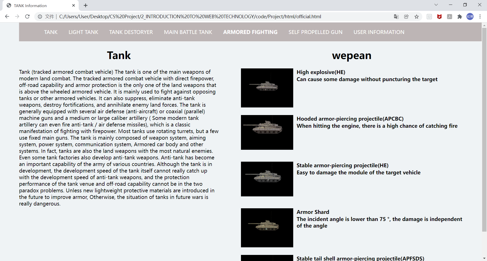
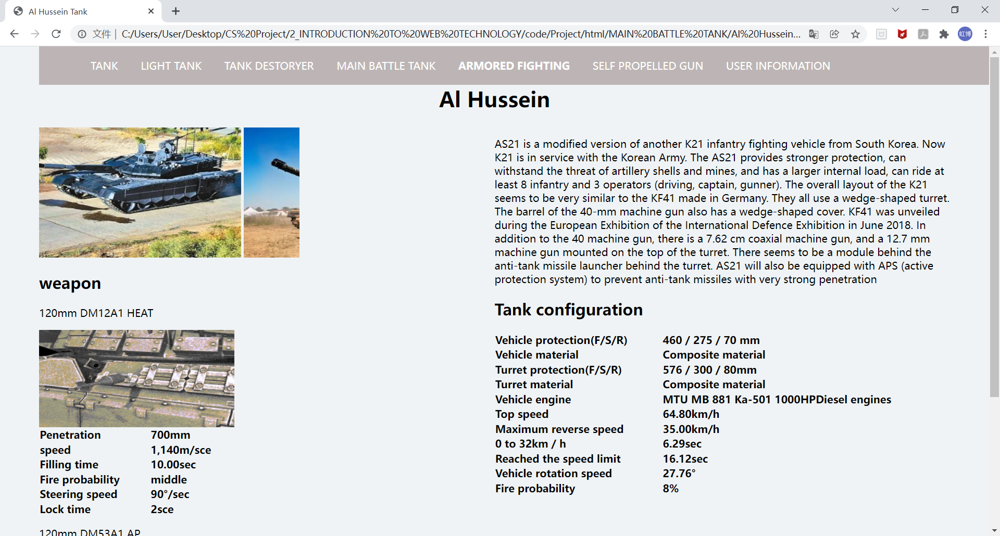

# **Tank-Information-website**

-----

>  Team: [@Hongbo Wang ](https://github.com/BOBWang1117)
>
>  

## **Environment:**

- HTML
- js
- css

## **Details**

- Type: term project
- Teacher: 赵庆林
- Computer Language: Html, css, js
- Project Name: Tank-Information-website
- Time: 2019/05/23
- Description: Complete the design of the web page by writing html language, this web page completes the insertion of pictures, text, videos and the design of the navigation bar

## **Dependencies:** 

- None

## **Install package:**

- None

## **Run program:**

- download /code/**Project** [Warming: Download the folder(**Project**) as a whole]
- double chick MyHomePage.html

## **Example:**

1. 

   

2. 

   

3. 

